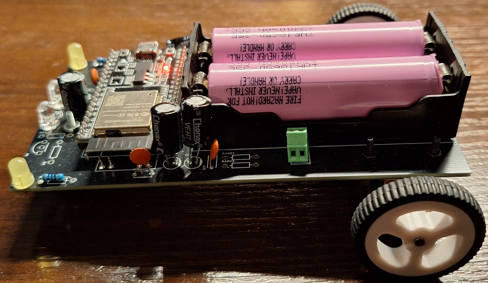

# dotRobot
Two-wheeled robot car amateur project, controlled via Bluetooth LE and powered by ESP32 dev board.\
Programmed using:
- nanoFramework on ESP32
- .NET 10 and MAUI on Windows/Android application

